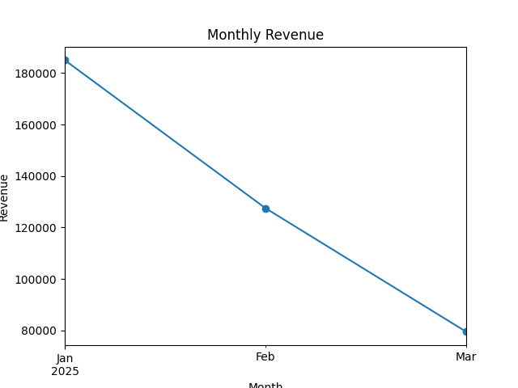

# 📊 Sales Data Analysis Project

## 🔹 Objective
Analyze a sales dataset to identify monthly revenue trends,
best-selling products, and profit patterns using Python.

## 🔹 Dataset
File: sales.csv  
Contains Date, Product, Units_Sold, Unit_Price, Cost

## 🔹 Tools Used
- Python
- Pandas
- NumPy
- Matplotlib

## 🔹 Analysis Done
✔ Monthly Revenue  
✔ Best Selling Products  
✔ Profit Trend  

## 🔹 Visualizations
- Line Chart → Monthly Revenue
- Bar Chart → Best Products
- Pie Chart → Profit Share
## 📈 Monthly Revenue

## 📊 Best Products

## 🥧 Profit Share

## 🔹 Final Insights
- January recorded the highest revenue.
- Laptop generated the maximum profit.
- Mouse was the best-selling product.
- Revenue decreased after January.

## 🔹 Project Structure

sales-data-analysis/
│
├── data/sales.csv
├── notebooks/sales_analysis.ipynb
├── Charts/
└── README.md

## 🔹 How to Run
1. Install Python libraries
2. Open sales_analysis.ipynb
3. Run all cells

## 🔹 Future Improvements
- Add interactive dashboard using Streamlit
- Use larger real-world dataset
- Add forecasting using Machine Learning

## 🔹 Author
Smruti Apar
CSE Student